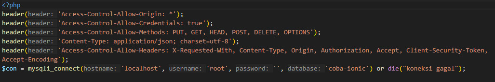
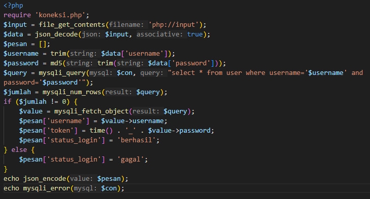
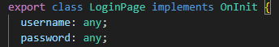
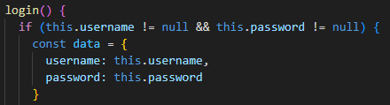
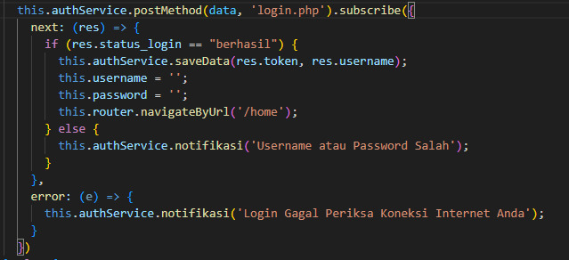
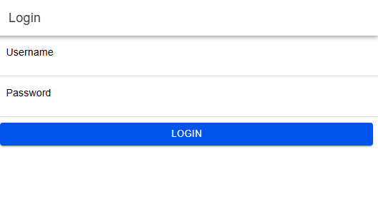
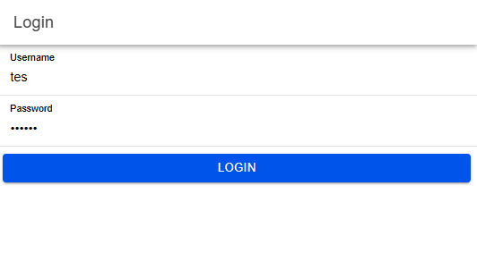
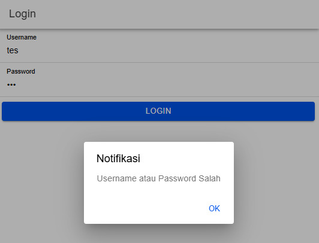
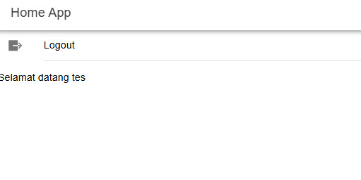

Cara Kerja Login Menggunakan Ionic

1.  Mendeklarasikan koneksi.php.
    a.  header: untuk mengizinkan Cross-Origin Resource Sharing (CORS) untuk komunikasi antara server dan aplikasi Ionic. 
    b.  mysqli_connect: membuat koneksi ke database coba-ionic dan apabila koneksi gagal, koneksi akan berhenti dan menampilkan pesan "koneksi gagal".
    c.  

2.  Memproses data login yang dikirm dari aplikasi Ionic
    a.  require 'koneksi.php': menghubungkan file ke database menggunakan koneksi di koneksi.php.
    b.  $input = file_get_contents('php://input'): mengambil data JSON yang dikirim dari aplikasi dalam bentuk teks.
    c.  $data = json_decode($input, true): mengambil data JSON yang dikirimkan oleh aplikasi dari request dan mendekodekannya menjadi array asosiatif.
    d.  $username = trim($data['username']): mengamil dan menghapus spasi berlebih pada username.
    e.  $password = md5(trim($data['password'])): mengamil dan menghapus spasi berlebih pada password serta melakukan enskripsi password dengan md5.
    d.  $query = mysqli_query($con, "select * from user where username='$username' and password='$password'"): mencari pengguna dalam tabel user berdasarkan username dan password yang diberikan. Hasil query akan menyimpan data pengguna jika ditemukan.
    e.  value = mysqli_fetch_object($query): mengambil data pengguna setelah mencari username dan password yang cocok sehingga data pengguna dapat diakses melalui properti objek.
    f.  $pesan['username'] = $value->username: menyimpan nilai username dari objek pengguna ($value->username) ke dalam array $pesan dengan kunci 'username' sehingga dapat menampilkan nama pengguna atau kebutuhan lainnya.
    g.  pesan['token'] = time() . '_' . $value->password: membuat token unik untuk pengguna dengan menggabungkan stempel waktu saat ini (time()) dengan password yang sudah terenkripsi ($value->password) sehingga dapat digunakan untuk mengelola sesi pengguna.
    h.  $pesan['status_login'] = 'berhasil': menyimpan status login ('berhasil') ke dalam array $pesan untuk memberi tahu aplikasi klien bahwa login berhasil.
    i.  $pesan['status_login'] = 'gagal': apabila pengguna tidak cocok, status login diatur menjadi 'gagal'.
    j.  echo json_encode($pesan): mengirimkan respons ke aplikasi dalam format JSON yang berisi informasi apakah login berhasil atau gagal dan data pengguna yang relevan (jika berhasil).
    k.  

3.  File app.module.ts untuk mengimpor modul yang dibutuhkan seperti BrowserModule, IonicModule, dan AppRoutingModule.

4.  File authentication.service.ts untuk mengatur proses autentikasi pengguna.
    a.  Preferences.set({ key: TOKEN_KEY, value: token }): menyimpan nilan token yang diterima sebagai parameter metode saveData disimpan di perangkat sehingga tetap dapat diakses meskipun aplikasi di-restart.
    b.  Preferences.set({ key: USER_KEY, value: user }): menyimpan informasi pengguna (seperti username) ke penyimpanan lokal dengan kunci USER_KEY dan bisa diambil kembali untuk menampilkan informasi pengguna atau kebutuhan lainnya di aplikasi.

5.  File auth.guard.ts untuk mengizinkan akses ke halaman hanya jika pengguna sudah login.

6.  File auto-login.guard.ts untuk mengecek status login.

7.  File app-routing.module.ts untuk melakukan konfigurasi routing.

8.  File login.page.html untuk menampilkan halaman login.
    a.  ion-input: memasukkan username dan password dengan dua arah binding ke properti masing-masing username dan password.
    b.  (click)="login(): menampung tombol login yang ketika tombol diklik akan memproses login. 

9.  File login.page.ts untuk mengirim data login ke server.
    a.  class LoginPage: mendeklarasikan komponen LoginPage dengan properti username dan password untuk menampung input pengguna.
        
    b.  login(): fungsi untuk memproses login dengan memeriksa apakah username dan password tidak null, serta menyusun objek data.
        
    c.  Mengirimkan permintaan POST ke login.php menggunakan metode postMethod dari AuthenticationService. Jika login berhasil, data disimpan, dan pengguna diarahkan ke halaman home. Jika gagal, akan muncul notifikasi.
        

10. File home.page.html untuk menampilkan halaman home.

11. File home.page.ts untuk mendapatkan data nama pengguna yang login.

Alur Proses Login
1.  Menampilkan halaman login
    
2.  Pengguna memasukkan username dan password di halaman login.
    
3.  Nofikasi muncul apabila terdapat kesalahan pengguna dalam mengisikan username atau password.
    
4.  Apabila username dan password benar, maka pengguna akan dialihkan ke halaman home.
    
